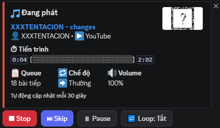
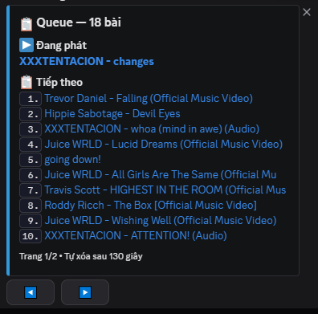
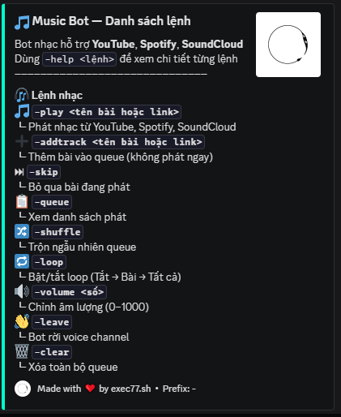

# 🎵 Music Bot

<div align="center">


🇻🇳 Bot nhạc Discord mạnh mẽ hỗ trợ **YouTube**, **Spotify**, **SoundCloud**

🇬🇧 A powerful Discord music bot supporting **YouTube**, **Spotify**, and **SoundCloud**

<br>





</div>

---

## 📋 Mục lục / Table of Contents

- [Tính năng / Features](#-tính-năng--features)
- [Yêu cầu hệ thống / System Requirements](#-yêu-cầu-hệ-thống--system-requirements)
- [Cài đặt / Installation](#-cài-đặt--installation)
  - [1. Cài Java](#1-cài-java--install-java)
  - [2. Tải Lavalink](#2-tải-lavalink--download-lavalink)
  - [3. Clone repo](#3-clone-repo)
  - [4. Cài Python packages](#4-cài-python-packages--install-python-packages)
  - [5. Tạo Discord Bot](#5-tạo-discord-bot--create-discord-bot)
  - [6. Cấu hình .env](#6-cấu-hình-env--configure-env)
  - [7. Cấu hình Lavalink](#7-cấu-hình-lavalink--configure-lavalink)
  - [8. Chạy bot](#8-chạy-bot--run-the-bot)
- [Danh sách lệnh / Commands](#-danh-sách-lệnh--commands)
- [Cấu trúc thư mục / Project Structure](#-cấu-trúc-thư-mục--project-structure)
- [Xử lý lỗi / Troubleshooting](#-xử-lý-lỗi--troubleshooting)

---

## ✨ Tính năng / Features

| Lệnh / Command | 🇻🇳 Mô tả | 🇬🇧 Description |
|---|---|---|
| `-play <tên/link>` | Phát nhạc từ YouTube, Spotify, SoundCloud | Play music from YouTube, Spotify, SoundCloud |
| `-addtrack <tên/link>` | Thêm bài vào queue không phát ngay | Add a track to queue without playing immediately |
| `-skip` | Bỏ qua bài đang phát | Skip the currently playing track |
| `-skipto <số>` | Nhảy đến bài thứ N trong queue | Jump to track N in the queue |
| `-queue` | Xem danh sách phát | View the current queue |
| `-shuffle` | Trộn ngẫu nhiên queue | Shuffle the queue randomly |
| `-loop` | Bật/tắt loop (Tắt → Bài → Tất cả) | Toggle loop mode (Off → Track → All) |
| `-volume <0-1000>` | Chỉnh âm lượng | Adjust playback volume |
| `-leave` | Bot rời voice channel | Disconnect the bot from voice |
| `-clear` | Xóa toàn bộ queue | Clear the entire queue |

---

## 💻 Yêu cầu hệ thống / System Requirements

| Thành phần / Component | Phiên bản tối thiểu / Minimum Version |
|---|---|
| Python | 3.10+ |
| Java | 17+ |
| RAM | 512 MB+ |
| OS | Windows 10 / Ubuntu 20.04 / macOS 12+ |

---

## 🚀 Cài đặt / Installation

### 1. Cài Java / Install Java

> 🇻🇳 Lavalink yêu cầu **Java 17 trở lên**. Kiểm tra phiên bản Java hiện tại bằng lệnh:
>
> 🇬🇧 Lavalink requires **Java 17 or higher**. Check your current Java version with:

```bash
java -version
```

**Windows:**

🇻🇳 Tải Java 17 tại [https://adoptium.net](https://adoptium.net) → chọn **Temurin 17** → chạy file `.msi` để cài đặt.

🇬🇧 Download Java 17 from [https://adoptium.net](https://adoptium.net) → select **Temurin 17** → run the `.msi` installer.

**Ubuntu / Debian:**

```bash
sudo apt update
sudo apt install openjdk-17-jdk -y
java -version   # xác nhận / verify
```

**macOS:**

```bash
brew install openjdk@17
java -version   # xác nhận / verify
```

---

### 2. Tải Lavalink / Download Lavalink

🇻🇳 Tạo một thư mục riêng cho Lavalink (ví dụ `lavalink/`) và tải file jar mới nhất:

🇬🇧 Create a dedicated folder for Lavalink (e.g. `lavalink/`) and download the latest jar:

```bash
mkdir lavalink
cd lavalink
```

🇻🇳 Truy cập [trang releases của Lavalink](https://github.com/lavalink-devs/Lavalink/releases) → tải file **`Lavalink.jar`** từ bản release mới nhất → đặt vào thư mục `lavalink/`.

🇬🇧 Go to the [Lavalink releases page](https://github.com/lavalink-devs/Lavalink/releases) → download **`Lavalink.jar`** from the latest release → place it in the `lavalink/` folder.

---

### 3. Clone repo

🇻🇳 Tải source code của bot về máy:

🇬🇧 Clone the bot's source code to your machine:

```bash
git clone https://github.com/your-username/your-repo.git
cd your-repo
```

🇻🇳 Hoặc tải thủ công bằng cách nhấn **Code → Download ZIP** trên GitHub, sau đó giải nén.

🇬🇧 Or download manually by clicking **Code → Download ZIP** on GitHub, then unzip.

---

### 4. Cài Python packages / Install Python packages

🇻🇳 Khuyến nghị tạo môi trường ảo (virtual environment) để tránh xung đột thư viện:

🇬🇧 It is recommended to use a virtual environment to avoid library conflicts:

```bash
# Tạo virtual environment / Create virtual environment
python -m venv venv

# Kích hoạt / Activate
# Windows:
venv\Scripts\activate
# macOS / Linux:
source venv/bin/activate

# Cài thư viện / Install packages
pip install -r requirements.txt
```

🇻🇳 Kiểm tra cài đặt thành công:

🇬🇧 Verify the installation:

```bash
pip show discord.py wavelink python-dotenv
```

---

### 5. Tạo Discord Bot / Create Discord Bot

🇻🇳 **Bước 5.1** — Truy cập [Discord Developer Portal](https://discord.com/developers/applications) và đăng nhập bằng tài khoản Discord.

🇬🇧 **Step 5.1** — Go to the [Discord Developer Portal](https://discord.com/developers/applications) and log in with your Discord account.

🇻🇳 **Bước 5.2** — Nhấn **New Application** → đặt tên cho bot → nhấn **Create**.

🇬🇧 **Step 5.2** — Click **New Application** → enter a name for your bot → click **Create**.

🇻🇳 **Bước 5.3** — Vào tab **Bot** ở thanh bên trái → nhấn **Add Bot** → xác nhận.

🇬🇧 **Step 5.3** — Go to the **Bot** tab in the left sidebar → click **Add Bot** → confirm.

🇻🇳 **Bước 5.4** — Trong mục **Privileged Gateway Intents**, bật **tất cả 3 intents** sau:

🇬🇧 **Step 5.4** — Under **Privileged Gateway Intents**, enable **all 3** of the following:

```
✅ PRESENCE INTENT
✅ SERVER MEMBERS INTENT
✅ MESSAGE CONTENT INTENT   ← bắt buộc / required
```

🇻🇳 **Bước 5.5** — Nhấn **Reset Token** → sao chép token → lưu lại để dùng ở Bước 6.

🇬🇧 **Step 5.5** — Click **Reset Token** → copy the token → save it for Step 6.

> ⚠️ 🇻🇳 **Không chia sẻ token với bất kỳ ai!** Token giống như mật khẩu của bot.
>
> ⚠️ 🇬🇧 **Never share your token with anyone!** The token is your bot's password.

🇻🇳 **Bước 5.6** — Mời bot vào server: vào tab **OAuth2 → URL Generator** → tích chọn:

🇬🇧 **Step 5.6** — Invite the bot to your server: go to **OAuth2 → URL Generator** → select:

```
Scopes:
  ✅ bot

Bot Permissions:
  ✅ Send Messages
  ✅ Embed Links
  ✅ Read Message History
  ✅ Connect
  ✅ Speak
  ✅ Use Voice Activity
```

🇻🇳 Sao chép URL được tạo ra → mở trên trình duyệt → chọn server → nhấn **Authorize**.

🇬🇧 Copy the generated URL → open it in a browser → select your server → click **Authorize**.

---

### 6. Cấu hình `.env` / Configure `.env`

🇻🇳 Sao chép file mẫu:

🇬🇧 Copy the example file:

```bash
cp .env.example .env
```

🇻🇳 Mở file `.env` bằng bất kỳ trình soạn thảo nào (Notepad, VS Code, nano…) và điền đầy đủ:

🇬🇧 Open `.env` with any text editor (Notepad, VS Code, nano…) and fill in all values:

```env
# ─── Discord ─────────────────────────────────────────────────────
# 🇻🇳 Token lấy ở Bước 5.5 / 🇬🇧 Token from Step 5.5
TOKEN=your_bot_token_here

# ─── Lavalink ────────────────────────────────────────────────────
# 🇻🇳 Giữ nguyên nếu chạy Lavalink trên cùng máy với bot
# 🇬🇧 Keep as-is if running Lavalink on the same machine as the bot
LAVALINK_URI=http://127.0.0.1:2333
LAVALINK_PASSWORD=youshallnotpass

# ─── Spotify (tuỳ chọn / optional) ──────────────────────────────
# 🇻🇳 Lấy tại https://developer.spotify.com/dashboard
# 🇬🇧 Get from https://developer.spotify.com/dashboard
SPOTIFY_CLIENT_ID=your_spotify_client_id
SPOTIFY_CLIENT_SECRET=your_spotify_client_secret
```

> ⚠️ 🇻🇳 File `.env` đã có trong `.gitignore` — **không bao giờ commit file này lên GitHub**.
>
> ⚠️ 🇬🇧 The `.env` file is already in `.gitignore` — **never commit this file to GitHub**.

**Lấy Spotify credentials (tuỳ chọn) / Get Spotify credentials (optional):**

🇻🇳 Truy cập [Spotify Developer Dashboard](https://developer.spotify.com/dashboard) → đăng nhập → nhấn **Create app** → điền tên và mô tả → sao chép **Client ID** và **Client Secret**.

🇬🇧 Go to the [Spotify Developer Dashboard](https://developer.spotify.com/dashboard) → log in → click **Create app** → fill in name and description → copy the **Client ID** and **Client Secret**.

---

### 7. Cấu hình Lavalink / Configure Lavalink

🇻🇳 Tạo file `application.yml` trong thư mục `lavalink/` với nội dung sau:

🇬🇧 Create `application.yml` inside your `lavalink/` folder with the following content:

```yaml
server:
  port: 2333
  address: 0.0.0.0

lavalink:
  server:
    password: "youshallnotpass"
    sources:
      youtube: true
      soundcloud: true
      twitch: true
      http: true
    bufferDurationMs: 400
    frameBufferDurationMs: 5000

logging:
  level:
    root: INFO
    lavalink: INFO
```

> 🇻🇳 Nếu bạn đổi `password` ở đây, hãy cập nhật `LAVALINK_PASSWORD` trong `.env` cho khớp.
>
> 🇬🇧 If you change the `password` here, update `LAVALINK_PASSWORD` in your `.env` to match.

🇻🇳 Khởi động Lavalink trong thư mục `lavalink/`:

🇬🇧 Start Lavalink from inside the `lavalink/` folder:

```bash
cd lavalink
java -jar Lavalink.jar
```

🇻🇳 Chờ đến khi thấy dòng sau trong console (khoảng 5–10 giây):

🇬🇧 Wait until you see this line in the console (about 5–10 seconds):

```
Started Launcher in X seconds
```

> 🇻🇳 **Giữ cửa sổ Lavalink mở.** Lavalink phải chạy trong suốt thời gian bot hoạt động.
>
> 🇬🇧 **Keep the Lavalink window open.** Lavalink must stay running the entire time the bot is active.

---

### 8. Chạy bot / Run the bot

🇻🇳 Mở terminal **mới** (giữ nguyên terminal Lavalink đang chạy), kích hoạt virtual environment, rồi chạy bot:

🇬🇧 Open a **new** terminal (keep the Lavalink terminal running), activate the virtual environment, then start the bot:

```bash
# Windows
venv\Scripts\activate
python main.py

# macOS / Linux
source venv/bin/activate
python main.py
```

🇻🇳 Nếu mọi thứ hoạt động đúng, bạn sẽ thấy trong console:

🇬🇧 If everything is working correctly, you should see in the console:

```
✅ Loaded utils.status
✅ Loaded cogs.music.play
✅ Loaded cogs.music.addtrack
✅ Loaded cogs.music.skip
✅ Loaded cogs.music.skipto
✅ Loaded cogs.music.queue
✅ Loaded cogs.music.shuffle
✅ Loaded cogs.music.loop
✅ Loaded cogs.music.volume
✅ Loaded cogs.music.leave
✅ Loaded cogs.music.clear_queue
🔥 Lavalink connected!
🤖 Bot ready: YourBotName#1234
```

🇻🇳 Bot đã sẵn sàng! Vào Discord, vào voice channel và thử lệnh `-play <tên bài>`.

🇬🇧 The bot is ready! Go to Discord, join a voice channel and try `-play <song name>`.

---

## 📁 Cấu trúc thư mục / Project Structure

```
music-bot/
│
├── main.py                 # 🇻🇳 Điểm khởi động / 🇬🇧 Entry point
├── config.py               # 🇻🇳 Đọc cấu hình từ .env / 🇬🇧 Loads config from .env
├── requirements.txt        # 🇻🇳 Danh sách thư viện / 🇬🇧 Python dependencies
│
├── .env                    # 🔐 KHÔNG commit / DO NOT commit
├── .env.example            # 🇻🇳 File mẫu / 🇬🇧 Template file
├── .gitignore
│
├── cogs/
│   └── music/
│       ├── play.py         # -play
│       ├── addtrack.py     # -addtrack
│       ├── skip.py         # -skip
│       ├── skipto.py       # -skipto
│       ├── queue.py        # -queue
│       ├── shuffle.py      # -shuffle
│       ├── loop.py         # -loop
│       ├── volume.py       # -volume
│       ├── leave.py        # -leave
│       └── clear_queue.py  # -clear
│
├── utils/
│   ├── help.py             # 🇻🇳 Lệnh help tùy chỉnh / 🇬🇧 Custom help command
│   ├── helpers.py          # 🇻🇳 Hàm tiện ích dùng chung / 🇬🇧 Shared utilities
│   ├── nowplaying.py       # 🇻🇳 Embed Now Playing + nút / 🇬🇧 Now Playing embed + buttons
│   └── status.py           # 🇻🇳 Trạng thái bot & kênh / 🇬🇧 Bot & voice channel status
│
└── lavalink/               # 🇻🇳 Tạo thủ công / 🇬🇧 Create manually
    ├── Lavalink.jar
    └── application.yml
```

---

## 🛠️ Xử lý lỗi / Troubleshooting

**❌ `Lavalink connection refused`**

🇻🇳 Lavalink chưa chạy hoặc sai cổng. Kiểm tra terminal Lavalink và đảm bảo `LAVALINK_URI` trong `.env` khớp với `port` trong `application.yml`.

🇬🇧 Lavalink is not running or using the wrong port. Check the Lavalink terminal and make sure `LAVALINK_URI` in `.env` matches the `port` in `application.yml`.

---

**❌ `TOKEN is None`**

🇻🇳 File `.env` không tồn tại hoặc `TOKEN` chưa được điền. Kiểm tra tên file (phải là `.env`, không phải `.env.example`) và nội dung bên trong.

🇬🇧 The `.env` file doesn't exist or `TOKEN` is not set. Check the filename (must be `.env`, not `.env.example`) and its contents.

---

**❌ Bot không phản hồi lệnh / Bot doesn't respond to commands**

🇻🇳 Vào Developer Portal → tab **Bot** → kiểm tra **MESSAGE CONTENT INTENT** đã được bật chưa.

🇬🇧 Go to the Developer Portal → **Bot** tab → verify **MESSAGE CONTENT INTENT** is enabled.

---

**❌ Không có âm thanh / No audio output**

🇻🇳 Thử `-leave` rồi `-play` lại. Đảm bảo Lavalink đang chạy và bot có quyền **Connect** + **Speak** trong voice channel.

🇬🇧 Try `-leave` then `-play` again. Make sure Lavalink is running and the bot has **Connect** + **Speak** permissions in the voice channel.

---

**❌ `java: command not found`**

🇻🇳 Java chưa cài hoặc chưa thêm vào PATH. Cài lại Java 17 và khởi động lại terminal.

🇬🇧 Java is not installed or not in PATH. Reinstall Java 17 and restart your terminal.

---

## 📄 License

MIT — 🇻🇳 Tự do sử dụng, chỉnh sửa và phân phối. / 🇬🇧 Free to use, modify, and distribute.
